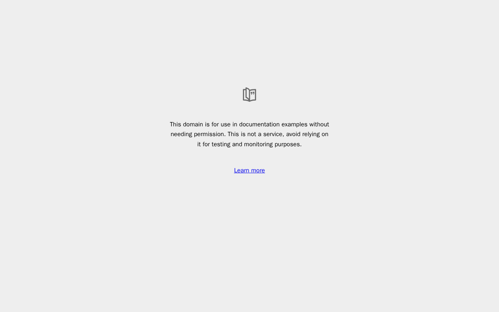

# Personal Jetson computer

The OpenMuse browser and isolated Linux workspace are deployed on `root@100.114.236.60`, the ARM64 Jetson Orin Nano.
The frontend remains on free Render; the API and OmniRoute remain on moonscape.
No additional paid services were created.

## Use it

With Tailscale connected, refresh https://openmuse-zeeshan.onrender.com/ and open **Computer**.
For the terminal, choose **Terminal > Start computer** and run `pwd` or `python3 --version`.
The **Files** view shares the terminal's persistent `/workspace` volume.
Open the browser to visit a public website and inspect or take over its work.
This is a Linux container and Chromium, not control of the Jetson's physical desktop.

## Services and storage

| Host | Service | Deployment |
| --- | --- | --- |
| Jetson | `openmuse-engine` | Dedicated Docker 29.3.1 engine with mutual TLS on tailnet address `100.114.236.60:2376` |
| Jetson | `openmuse-browser` | ARM64 `openmuse-browser:cf855db`, bearer-token-protected worker on `100.114.236.60:8790` |
| moonscape | `openmuse-personal` | Existing API image plus Docker CLI, tagged `openmuse-personal:jetson-cf855db` |

The browser profiles are in the `openmuse-browser-profiles` Docker volume.
The dedicated engine's images and workspace volumes are inside `openmuse-engine-root-data`.
The engine's certificates are in `openmuse-engine-tls`.
Jetson Docker storage is under `/mnt/data/docker`.
The private worker environment is `/mnt/data/projects/OpenMuse-computer/.openmuse/worker.env`.
On moonscape, private client certificates are under the deployed project's `.openmuse/docker-tls`, mounted read-only at `/run/openmuse/docker-tls` in the API.
Both long-running Jetson services use `unless-stopped` restart policies.
Individual terminal containers use the application's explicit Start/Stop lifecycle; volumes survive those operations.

The user authorized stopping `minicpm5-vllm-awq-v3` to free memory.
It was stopped after the model's request log reported zero active and waiting requests.
The model directory `/mnt/data/models` was not changed or deleted.
Other existing Jetson containers were left running.
To restore vLLM later, first stop OpenMuse browser sessions and assess available RAM; the previous model server alone used about 6.1 GiB.

## Boundaries

The API connects to a dedicated engine, not the Jetson's existing host Docker socket.
The engine requires client certificates; its published port is bound only to the tailnet address.
The browser port also binds only to the tailnet address and requires a server-only token.
HTTP between moonscape and the browser worker travels over encrypted Tailscale transport.
No worker token, TLS private key, Google credential, or model key goes to the frontend.

The Linux workspace runs as UID 1000 with a read-only root filesystem, no network, dropped capabilities, no host-directory mounts, and bounded command execution.
Its persistent `/workspace` is a named volume.
The browser runs separately as a nonroot user with a read-only root filesystem, dropped capabilities, and bounded memory, temporary storage, and process count.
Public-destination checks reject private browser URLs.

The dedicated engine itself requires a privileged infrastructure container.
The rootless engine was tested but the host's restricted user namespaces prevented it from starting; no global kernel or AppArmor policy was loosened.
This Docker setup is not a VM or a hostile-code isolation guarantee.
The browser uses Playwright's default Chromium sandbox settings, as documented in the worker README.
The moonscape host still cannot enforce the requested API memory limit; do not treat that setting as effective.

## Verification completed

One representative real deliverable was validated before connecting the production backend: a public-page PNG and a saved terminal file.
The browser screenshot was copied into this repository and visually inspected at 1280 × 800.
The terminal reported `aarch64`, persisted a text file, and saved its successful command receipt.
The file survived terminal stop/start.
Unauthenticated worker requests returned 401 and private-URL navigation returned 400.

`infra/verify-jetson-http.mjs` then exercised the real authenticated API over HTTP against the deployed Jetson services.
It used a temporary account/database and a separate deployment namespace, not the owner's production database.
It validated terminal start, command execution, file write/read, stop/start persistence, browser creation, page reading, PNG preview, and unauthenticated rejection.
Verification sessions were closed and verification computers were stopped afterward.

Both Jetson infrastructure services were restarted after confirming no terminal containers were running.
The original workspace file survived the engine restart; the original saved browser profile reopened after the worker restart.
The copied TLS client credentials continued to work after restart.
The production API's Docker connection reported ARM64 and its authenticated browser-worker request returned 200.
Production health reports `ok: true`, `mode: live`, `agentConfigured: true`, and `browserConfigured: true`.
The existing owner account still reports password login with no setup required.
The harness restart did not stop the deployed services; only the obsolete local login smoke server was cancelled.

This is backend/worker and HTTP verification, not a claim that the hosted UI was independently dogfooded.
The user-controlled browser session was not resumed.



## Build and configuration helpers

- `infra/Dockerfile.api-computer` adds the Docker CLI to an existing API image without rebuilding or changing application source.
- `infra/configure-computer.mjs` runs in the moonscape deployment checkout, backs up the existing environment, preserves unrelated settings, and enables the Jetson endpoints.
- `tests/computer-deployment.test.ts` verifies secret preservation and stable worker-token reuse.
- `infra/verify-jetson.mjs` runs inside the API image with temporary `/tmp` storage and a writable `/evidence` mount; it retains its PNG and JSON proof there.
- `infra/verify-jetson-http.mjs` runs inside the API image with temporary `/tmp` storage and the deployment's read-only TLS mount; it prints only pass/fail proof.

Jetson builds used tar contexts streamed over SSH into Docker, without installing host build tools.
Use `COPYFILE_DISABLE=1 tar --no-xattrs` for Mac-generated tar contexts; the host's legacy builder rejects `com.apple.provenance` attributes.
The Docker CLI included in the dedicated engine can build the Linux computer image directly:

```sh
COPYFILE_DISABLE=1 tar --no-xattrs -C apps/computer -cf - . | ssh root@100.114.236.60 'docker exec -i openmuse-engine docker build -t openmuse-computer:cf855db -'
COPYFILE_DISABLE=1 tar --no-xattrs -C apps/worker -cf - Dockerfile package.json package-lock.json src | ssh root@100.114.236.60 'docker build -t openmuse-browser:cf855db -'
```

The stopped pre-Jetson API container `openmuse-personal-before-jetson` and timestamped `.openmuse/deploy.env.before-computer-*` backup remain available for rollback.
Rollback must restore the matching old environment and API container together, without changing or deleting the persistent application data.
Do not run both API containers against the same embedded database.

Refs #1.
